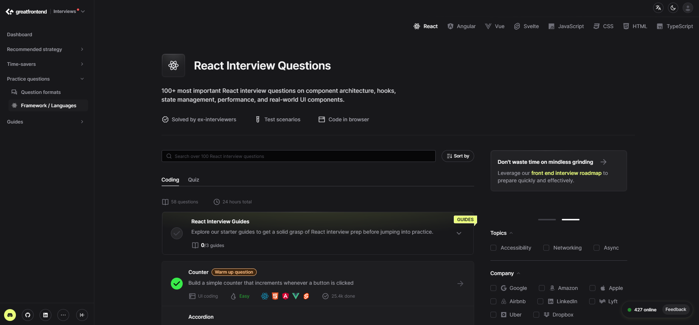
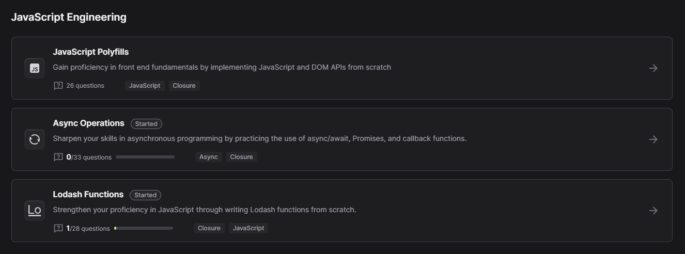
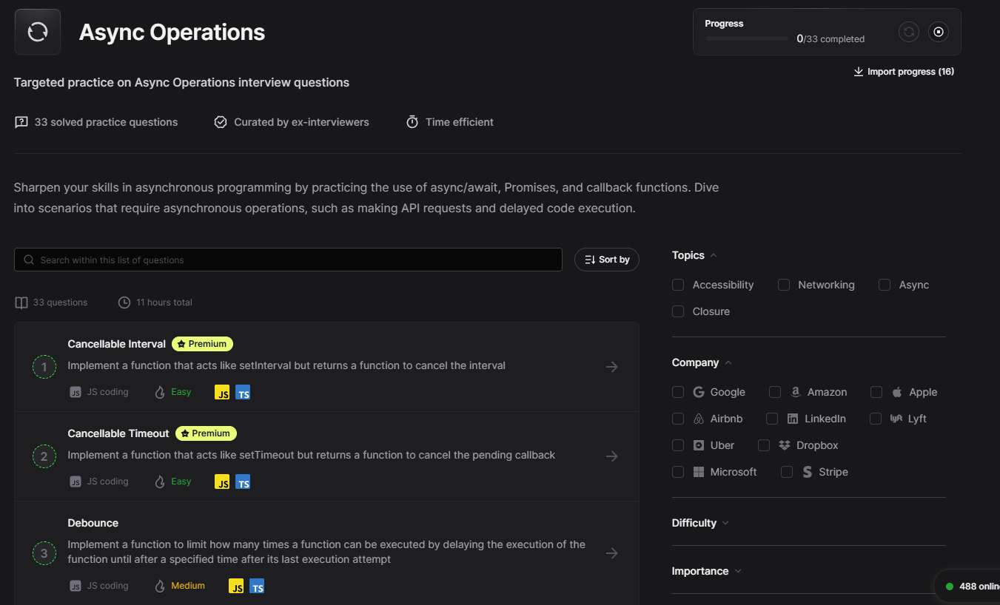
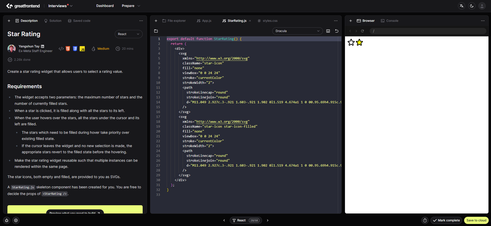
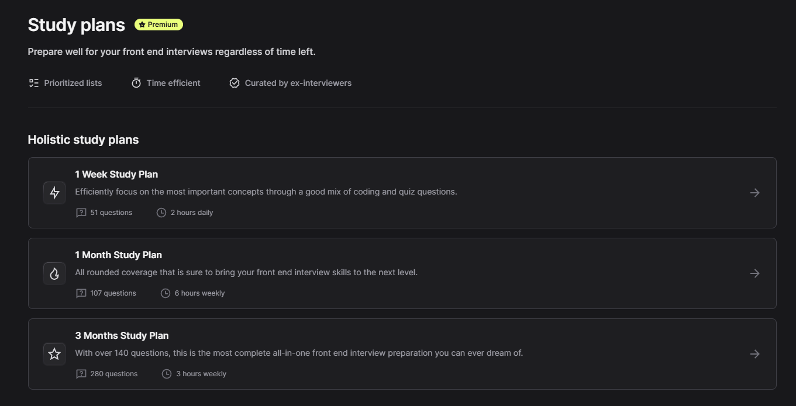
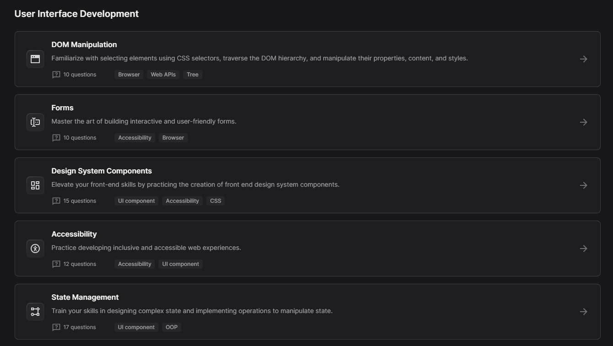

# Intuit's frontend interview experience and prep guide
Hi job seekers of frontend dev positions, I'd like to share my interview experience with Intuit for SWE (front-end track), as well as how I prepare such interviews.

### Format
Intuit's onsite interview, called ["craft demo"](https://www.intuit.com/careers/hiring-process/), consists of the following rounds:
```
Morning:
1. Craft preparation (90 mins)
2. Craft Demo (1hr) (Panel of - 3 SWE + 1 Manager)

Lunch Break (40 mins)

Afternoon:
3. Tech round (1hr) (with 2 of the SWE from panel) + restroom break
4. Tech round (45 mins) (with senior SWE from panel) + restroom break
5. Behavior round (30 mins) (with Manager from panel)
```
Before the interview, I was told to set up IDE of my choice as well as a local React boilerplate project. I was told to expect to build a single page application (SPA) based on the given prompt in the initial 90-minute round, and to present the project to the Panel in demo round. The API endpoints were given in the prompt. During the afternoon rounds, I would be asked follow-up questions, such as adding extra functionality, or adding unit tests (jest) and CSS styling, or deep dive on topics such as React hook API, JS async programming, page load time optimization, accessibility, etc. The 90-minute round was screen shared with an SWE from the Panel to resolve any problems I had. I was allowed to search on Google or Stack Overflow for API reference of libraries used.

### Prompt
`Build a phone book page that displays a list of contacts with their details, and allows the user to search the contact list by name or phone number.`


### How I prepared this interview:
I searched on GitHub and there were craft projects uploaded by some previous candidates, their code gives you a peek into the format and scope of the interview. But the most helpful resource I've found is this frontend interview prep website: [Great Front End](https://www.greatfrontend.com/), it helped a lot in brushing up my knowledge of the deepdive topics and practicing coding UI widgets under time constraints. Their founder is ex-Meta staff frontend engineer and the creator of the well-known curated list of [Blind 75](https://www.techinterviewhandbook.org/best-practice-questions/) and [bfe.dev](https://bfe.dev/).


Using GFE, you can practice following types of commonly asked frontend interview questions (hundreds already, more will be added in the future)
- [Quiz questions](https://www.greatfrontend.com/questions/quiz): Trivia-style questions of frontend dev concepts & fundamentals, e.g. [Explain how `this` works in JavaScript](https://www.greatfrontend.com/questions/quiz/explain-how-this-works-in-javascript?format=quiz). I was actually asked [How can you optimize network requests for better performance?](https://www.greatfrontend.com/questions/quiz/how-can-you-optimize-network-requests-for-better-performance?format=quiz) in the follow up round of the craft demo.
- [Implementing JS functions](https://www.greatfrontend.com/questions/javascript) such as [`throttle`](https://www.greatfrontend.com/questions/javascript/throttle?format=javascript) [`debounce`](https://www.greatfrontend.com/questions/javascript/debounce?format=javascript) [`Promise.all`](https://www.greatfrontend.com/questions/javascript/promise-all?format=javascript) [`flatten`](https://www.greatfrontend.com/questions/javascript/flatten?format=javascript) in online IDE: your submission will be judged against sample test cases (similar to leetcode), with reference implementation provided. I utilized `Promise.allSettled` in the craft demo which amazed the interviewers, but I won't tell them I learned it from GFE ;-). This type of questions are also asked during my interview with TikTok. Even practicing solving them alone will make you a better frontend dev by reinforcing your understanding of the JavaScript language & libraries


- [Coding UI widget](https://www.greatfrontend.com/questions/user-interface), such as [star rating](https://www.greatfrontend.com/questions/user-interface/star-rating?format=user-interface) or [todo list](https://www.greatfrontend.com/questions/user-interface/todo-list?format=user-interface), using framework of your choice (React/Angular/Vue/Svelte). Reference implementations are also provided.

- For interview of senior positions, GFE also has a dedicated section for [frontend system design](https://www.greatfrontend.com/front-end-system-design-playbook) using the [RADIO framework](https://www.greatfrontend.com/front-end-system-design-playbook/framework). Their answer key to each design question was quite comprehensive, covering all aspects of potential follow ups. I found this section to be the most educating and useful to my daily frontend development work.


All questions are tiered as easy/medium/hard and [labeled by companies](https://www.greatfrontend.com/interviews/company). If you have tight timeline, GFE also provides curated list of [study plans](https://www.greatfrontend.com/interviews/study-plans) and [focus areas](https://www.greatfrontend.com/interviews/focus-areas) to ensure your timed preparation covers important concepts.




GFE also has a discord community where people discuss the aforementioned interview questions, as well as knowledge sharing & finding mock interview buddies.

### The experience
Though the 90 min was a tight deadline to build an SPA with desired features, I think the overall interview was a good experience. I am very proud of my skills and the way they questioned me on everything, I definitely prefer it over leetcode questions that are not related to what we actually work on.

### The result
Two days after the interview, I was informed by HR that the feedback was positive and was extended offer one week later. I couldn't imagine how hard I'd been struggling prepping the interview the other way - digesting fragmented knowledge from various online sources. [GFE](https://www.greatfrontend.com/) boosts my confidence before and during the interview. It is now THE single all-in-one frontend prep guide of my future interviews, and it could be the same to you.
